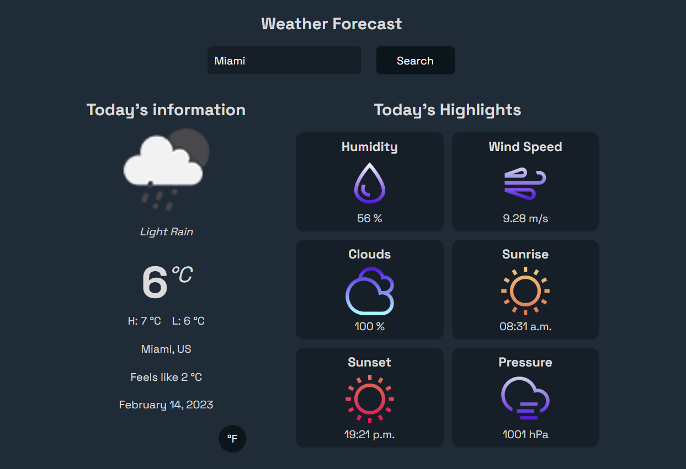

# Weather App

This project uses the [OpenWeather](https://openweathermap.org/) API to search for weather and get information about it. It's built with React.



## API Reference

#### Coordinates by location name

```http
  GET http://api.openweathermap.org/geo/1.0/direct?q={city name}&limit={limit}&appid={API key}
```

| Parameter | Type     | Description                  |
| :-------- | :------- | :--------------------------- |
| `api_key` | `string` | **Required**. Your API key   |
| `q`       | `string` | **Required**. City name      |
| `limit`   | `number` | **optional**. limit response |

#### Call current weather data

```http
  GET https://api.openweathermap.org/data/2.5/weather?lat={lat}&lon={lon}&appid={API key}
```

| Parameter | Type     | Description                |
| :-------- | :------- | :------------------------- |
| `api_key` | `string` | **Required**. Your API key |
| `lat`     | `number` | **Required**. latitude     |
| `lon`     | `number` | **Required**. longitude    |

## Installation

Install my-project with npm

- Clone the repository on your local machine.
- Install the dependencies with npm install.
- Run the application with npm run dev.
- Open the application in your web browser at http://127.0.0.1:5173/

## Environment Variables

To run this project, you will need to add the following environment variables to your .env file

`VITE_APP_API_KEY`

`VITE_BASE_URL`

## Deployment

To deploy this project run

```bash
  npm run deploy
```

## Contributing

If you would like to contribute to this project, follow these steps:

- Fork the project.
- Create a new branch (git checkout -b feature/feature-name).
- Make the desired changes.
- Submit a pull request.

## Authors

- [stevenquintana](https://www.linkedin.com/in/stevenquintana/)

## License

This project is licensed under the MIT License. See the LICENSE file for more information.
